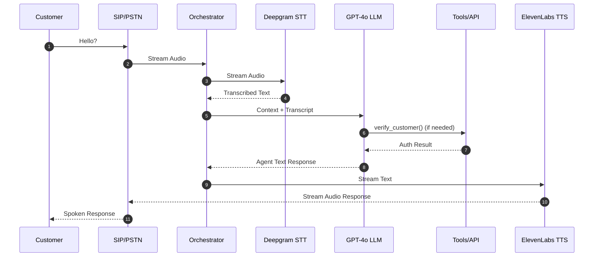
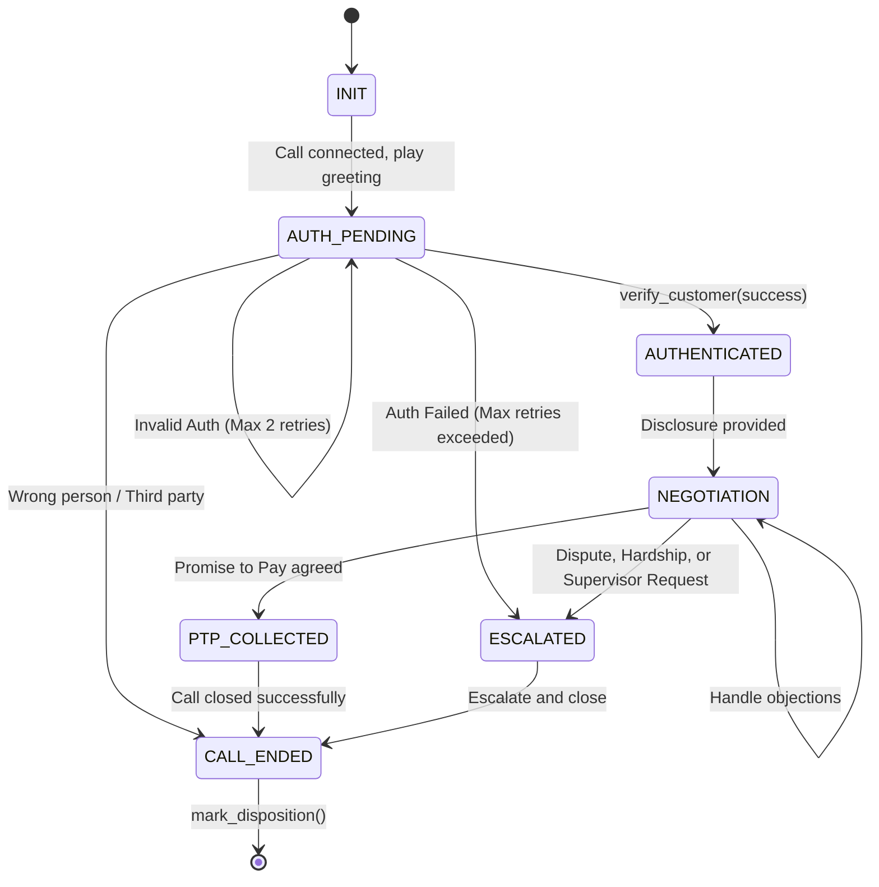

# High-Level Design (HLD) Document
**Project:** Kapture Finance Voice AI Collections Agent ('Maya')
**Version:** 1.0
**Target Audience:** Engineering, Product, and Compliance Teams

---

## Table of Contents
1. [Architecture & Pipeline](#1-architecture--pipeline)
2. [Conversation State Machine](#2-conversation-state-machine)
3. [Intents & Entities Table](#3-intents--entities-table)
4. [Tool / API Specifications](#4-tool--api-specifications)
5. [Auth & Data Safety](#5-auth--data-safety)
6. [Guardrails & Compliance](#6-guardrails--compliance)
7. [Edge Cases Matrix](#7-edge-cases-matrix)
8. [Escalation & Disposition](#8-escalation--disposition)
9. [Observability Metrics](#9-observability-metrics)

---

## 1. Architecture & Pipeline

### Overview
The system relies on a low-latency, streaming architecture that connects telephony infrastructure to a speech-to-text (STT) engine, an orchestrator utilizing a Large Language Model (LLM), and a text-to-speech (TTS) synthesis engine.

### Call Flow Sequence Diagram



### Latency Budget
Target end-to-end latency is **< 1.2s** to ensure a natural conversational flow.

| Hop | Component | Target Latency | Notes |
|-----|-----------|---------------|-------|
| 1 | Telephony (SIP/PSTN) | ~100ms | Call setup + audio routing |
| 2 | STT (Deepgram Nova-2) | ~200ms | Streaming transcription, telephony-optimized |
| 3 | LLM First Token (GPT-4o) | ~400ms | Function calling + response generation |
| 4 | TTS Synthesis (ElevenLabs) | ~300ms | Streaming synthesis, chunked delivery |
| 5 | Network Overhead | ~200ms | Webhook round-trips, buffer |
| | **Total** | **~1,200ms** | |

### Component Rationale
- **Deepgram Nova-2 (STT):** Chosen for its superior optimization for 8kHz telephony audio, high accuracy with Indian English/Hindi accents, and ultra-low streaming latency.
- **GPT-4o (LLM Orchestrator):** Provides state-of-the-art function calling capabilities necessary for deterministic state transitions and robust intent recognition, paired with low time-to-first-token.
- **ElevenLabs (TTS):** Selected for its natural, emotive, and conversational voice quality, reducing the "robotic" feel and increasing customer engagement.

---

## 2. Conversation State Machine

### State Diagram



### State Definitions & Transitions
1. **INIT**: Initial system state. Telephony connected.
2. **AUTH_PENDING**: Agent introduces itself without disclosing debt. Asks for verification.
   - **Trigger**: System connects.
   - **Auth Enforcement**: The transition to `AUTHENTICATED` is **strictly locked** behind a successful `verify_customer` tool call. The LLM prompt cannot bypass this state.
   - **Retry Logic**: Maximum 2 authentication failure retries. On 3rd failure, transition to `ESCALATED`.
3. **AUTHENTICATED**: Customer verified. Agent discloses company and debt details.
4. **NEGOTIATION**: Discussing payment options, dates, and amounts.
5. **PTP_COLLECTED**: Promise to pay successfully logged via `log_promise_to_pay`.
6. **ESCALATED**: Handing off to a human agent due to complex scenarios or auth failures.
7. **CALL_ENDED**: Terminal state. `mark_disposition` must be called.

---

## 3. Intents & Entities Table

| Intent | Description | Entities Extracted | Example Utterance | Next State / Tool |
|--------|-------------|-------------------|-------------------|-------------------|
| `Confirm_Identity` | Provides verification detail. | `Verification_Code` (String) | "My date of birth is 15th August 1985" | `verify_customer()` |
| `Promise_To_Pay` | Agrees to pay on a specific date. | `PTP_Date` (ISO-8601), `PTP_Amount` (Number) | "I will pay the 8000 rupees on Friday." | `log_promise_to_pay()` |
| `Hardship_Claim` | Unable to pay due to hardship. | `Hardship_Reason` (String) | "I lost my job last month." | `escalate_to_agent()` |
| `Dispute_Debt` | Customer denies owing the money. | None | "I have never taken a loan from you." | `escalate_to_agent()` |
| `Already_Paid` | Claims payment is already made. | `Payment_Reference` (String) | "I paid this yesterday, reference 12345." | `mark_disposition()` |
| `Request_DNC` | Do not call requests. | None | "Stop calling me!" | `mark_disposition()` |
| `Wrong_Person` | Customer is not the target. | None | "There is no Rahul here." | `mark_disposition()` |
| `Callback_Request`| Wants a callback later. | None | "I am busy, call me tomorrow." | `mark_disposition()` |
| `Hostile/Abusive` | Caller is swearing/abusive. | None | [Abusive language] | Disconnect & Disposition |

---

## 4. Tool / API Specifications

### 1. `verify_customer`
```json
{
  "name": "verify_customer",
  "description": "Verifies customer identity before discussing debt.",
  "parameters": {
    "type": "object",
    "properties": {
      "account_id": { "type": "string" },
      "verification_code": { "type": "string", "description": "Last 4 of PAN or DOB" }
    },
    "required": ["account_id", "verification_code"]
  }
}
```
**Output:** `{ "verified": boolean, "customer_name": string, "message": string }`
**Error:** `400 Bad Request` if format invalid; `404 Not Found` if mismatch.

### 2. `log_promise_to_pay`
```json
{
  "name": "log_promise_to_pay",
  "description": "Logs a confirmed promise to pay (PTP).",
  "parameters": {
    "type": "object",
    "properties": {
      "account_id": { "type": "string" },
      "ptp_date": { "type": "string", "format": "date" },
      "amount": { "type": "number" }
    },
    "required": ["account_id", "ptp_date", "amount"]
  }
}
```
**Output:** `{ "success": boolean, "ptp_id": string, "confirmed_date": string }`

### 3. `send_payment_link`
```json
{
  "name": "send_payment_link",
  "description": "Sends an SMS/WhatsApp payment link.",
  "parameters": {
    "type": "object",
    "properties": {
      "account_id": { "type": "string" },
      "channel": { "type": "string", "enum": ["SMS", "WHATSAPP"] }
    },
    "required": ["account_id", "channel"]
  }
}
```
**Output:** `{ "success": boolean, "link_sent": boolean, "message": string }`

### 4. `escalate_to_agent`
```json
{
  "name": "escalate_to_agent",
  "description": "Escalates call to human queue.",
  "parameters": {
    "type": "object",
    "properties": {
      "account_id": { "type": "string" },
      "reason": { "type": "string" },
      "notes": { "type": "string" }
    },
    "required": ["account_id", "reason"]
  }
}
```
**Output:** `{ "success": boolean, "ticket_id": string, "queue_position": integer }`

### 5. `mark_disposition`
```json
{
  "name": "mark_disposition",
  "description": "Records the final outcome of the call.",
  "parameters": {
    "type": "object",
    "properties": {
      "account_id": { "type": "string" },
      "status": { "type": "string" },
      "notes": { "type": "string" }
    },
    "required": ["account_id", "status"]
  }
}
```
**Output:** `{ "success": boolean, "disposition_logged": boolean, "timestamp": string }`

---

## 5. Auth & Data Safety

- **Identity Verification:** Ask for the last 4 digits of PAN or Date of Birth.
- **Pre-Auth Silence:** Under **NO CIRCUMSTANCES** will the agent mention 'overdue', 'loan', 'EMI', 'amount', or 'Kapture Finance debt' before `verify_customer` returns `verified: true`.
- **Third-Party Answering Protocol:** If an unverified person answers (e.g., family member), the agent states it is a personal business matter, asks for a good time to call back the target customer, and gracefully exits. No debt is disclosed.
- **PII Masking:** Logs must mask PII. (e.g., `Rahul S****`, `PAN: XXXX1234`).
- **Data Retention & Encryption:** All transcripts and audio recordings are encrypted at rest (AES-256) and in transit (TLS 1.2+). Audio logs deleted post-90 days unless disputed.

---

## 6. Guardrails & Compliance

- **RBI Fair Practices Code:** Strictly adhered to.
- **Mandatory Disclosure:** Post-authentication, the agent must immediately state its name ("Maya"), company ("Kapture Finance"), and the purpose of the call (EMI collection).
- **Calling Hours:** Enforced at the orchestrator dialer level: **08:00 AM – 07:00 PM local time only**.
- **No Threats/Harassment:** Agent prompts explicitly forbid threats, harassment, or coercion.
- **DNC Handling:** Immediate cessation of the call and logging of `DO_NOT_CALL` if requested.
- **Hallucination Prevention:** 
  - Agent CANNOT offer unauthorized waivers (capped at 10% strictly if configured).
  - Agent CANNOT make promises regarding credit score (CIBIL) impact specifics.
- **Off-Topic Deflection:** If the customer deviates, the agent politely redirects to the overdue payment.

---

## 7. Edge Cases Matrix

| Edge Case | Detection | Response | Tool Call | Disposition |
|-----------|-----------|----------|-----------|-------------|
| Already paid | Customer claims payment done. | Request reference, note it, and close call gracefully. | `mark_disposition()` | `ALREADY_PAID` |
| Disputes amount | Claims amount is wrong. | Do not argue. Escalate for human review. | `escalate_to_agent()` | `DISPUTED` |
| DNC request | Demands to stop calling. | Apologize, confirm DNC, hang up. | `mark_disposition()` | `DO_NOT_CALL` |
| Wrong number/person | States wrong person. | Apologize and hang up. | `mark_disposition()` | `WRONG_PERSON` |
| Voicemail / Silence | No input for 5s (x2). | Reprompt twice ("Are you there?"). Hang up. | `mark_disposition()` | `NO_RESPONSE` |
| Abusive caller | Profanity/Abuse detected. | Issue 1 polite warning. If repeated, soft hangup. | `mark_disposition()` | `ABUSIVE_CALLER` |
| Mid-call lang switch| Detects Hindi/Hinglish. | Transparently switch language in LLM context. | None | N/A |
| Network drop | SIP BYE received. | Immediately log drop. | `mark_disposition()` | `NETWORK_DROP` |
| Callback later | Customer asks for callback. | Ask for time, confirm, hang up. | `mark_disposition()` | `CALLBACK_REQUESTED`|
| Supervisor request | Asks for human/manager. | Acknowledge and transfer. | `escalate_to_agent()` | `ESCALATED` |
| Partial payment | Offers lower amount. | Reject if below threshold, or escalate. | `escalate_to_agent()` | `ESCALATED` |

---

## 8. Escalation & Disposition

**Escalation Triggers:**
- Hardship/Medical claims
- Dispute of debt or amount
- Explicit supervisor request
- Repeated authentication failures (max 2)
- Abusive caller (after 1 warning)

**Disposition Codes:**
Every call **MUST** end with a `mark_disposition` call.
- `PTP_AGREED`
- `ALREADY_PAID`
- `DISPUTED`
- `HARDSHIP_ESCALATED`
- `WRONG_PERSON`
- `DO_NOT_CALL`
- `NO_RESPONSE`
- `CALLBACK_REQUESTED`
- `ABUSIVE_CALLER`
- `NETWORK_DROP`
- `ESCALATED`

---

## 9. Observability Metrics

### Key Metrics
- **Containment Rate:** % of calls resolved without human escalation.
- **PTP Rate:** % of calls ending in a valid `PTP_AGREED`.
- **First Call Resolution (FCR):** % of valid dispositions logged on the first call attempt.
- **Avg End-to-End Latency:** Mean round-trip time per turn (Target: < 1.2s).
- **Auth Success Rate:** % of calls reaching `AUTHENTICATED` state.
- **Drop Rate:** % of calls dropped before a disposition is reached.
- **Compliance Score:** % of calls with zero pre-auth disclosure violations (audited via transcript analysis).

### Logging Strategy
- Structured JSON logs per call.
- Include: `call_id`, `account_id`, `timestamp`, `state_transitions`, `tool_calls`, `latency_ms`.
- PII explicitly stripped from logs.

### Dashboard Recommendations
- Real-time latency tracking (P50, P95, P99).
- Funnel chart: Total Calls → Connected → Authenticated → PTP Collected / Escalated.
- Disposition breakdown pie chart.
- Compliance violation alerts.
